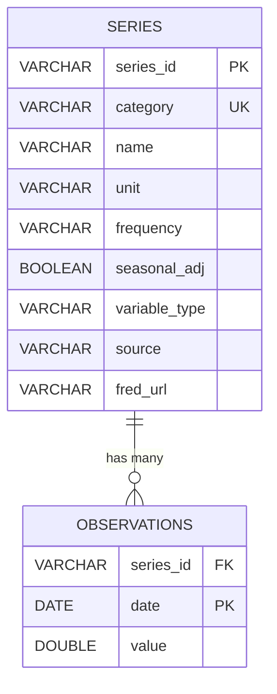

# Entity-Relationship Diagram

The database has a simple two-table design. `series` stores the metadata for
each FRED series, and `observations` stores the monthly (date, value) pairs
linked to a series via a foreign key.

The `variable_type` column in `series` distinguishes the **CPI** sub-indices
from the **monetary-policy** series — this lets the Python class default
its CPI-focused methods to the seven CPI categories and reserve the policy
series for methods that explicitly combine inflation with the policy rate.

A rendered PNG version of this diagram is also committed at
[`er_diagram.png`](er_diagram.png).

## Notes

- **Primary keys.**
  - `series.series_id` is the FRED identifier (e.g., `CPIAUCSL`, `FEDFUNDS`).
  - `observations` uses a **composite primary key** on `(series_id, date)` —
    each series has at most one observation per date.
- **Uniqueness.** `series.category` is also unique, so each human-readable
  category name (`housing`, `energy`, `policy_rate`, ...) maps to exactly
  one FRED series.
- **Cardinality.** One `series` has many `observations` (typically one per
  month from 1990-01 onward).
- **Variable type.** `variable_type` is one of `'cpi'` or `'policy'`. It
  drives the default category-filtering behavior of the Python class:
  CPI methods ignore policy series, and `plot_with_policy_rate` explicitly
  combines both types.
- **Normalisation.** Metadata lives only in `series`; the fact table
  `observations` is kept long and narrow.
